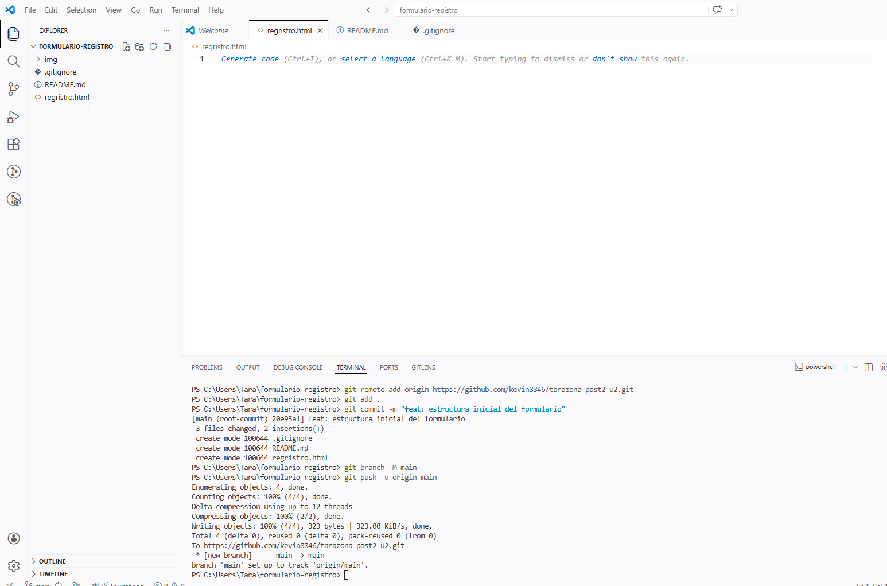

# Formulario de Registro HTML5 — [KevinTarazona]

## Descripción
Formulario de registro universitario desarrollado como laboratorio de
la Unidad 2 del curso de Programación Web. Implementa más de 10 tipos
de input de HTML5 con validación nativa, agrupación semántica con
fieldset/legend y atributos de accesibilidad ARIA.

## Tipos de input implementados
- text, email, password, tel, url, date
- number, range, color, file
- checkbox, radio, hidden
- textarea, select (con optgroup)

## Cómo ejecutar
1. Clonar: `git clone [URL-del-repo]`
2. Abrir en VS Code → clic derecho en `registro.html` → Open with Live Server
3. Navegar a `http://localhost:5500/registro.html`

## Capturas de pantalla
